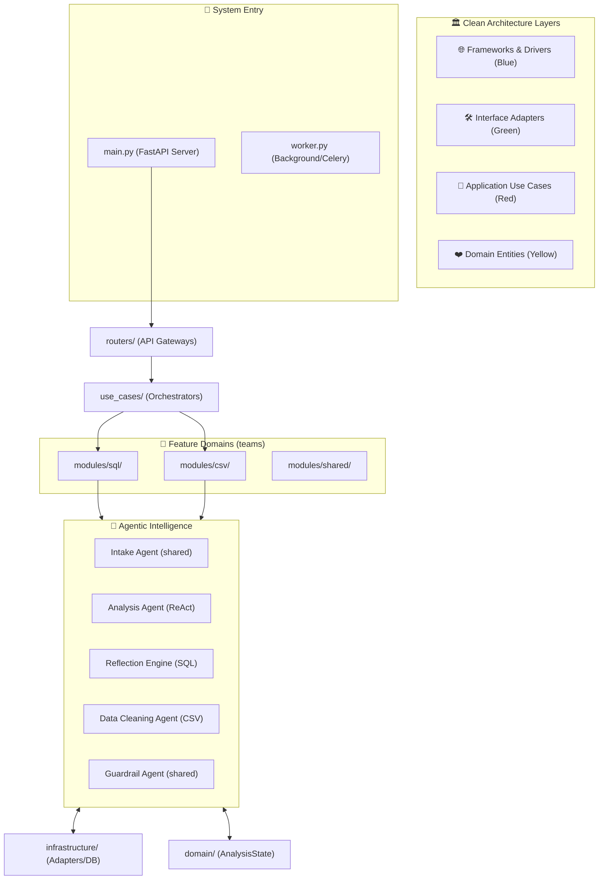

# 🏗️ The Recursive Blueprint: Full System Architecture Breakdown
**Target Path**: `C:\Users\Lenovo\Downloads\finalproject\app`

This document provides an exhaustive, file-by-file professional explanation of every component in the system. It maps the physical `tree` structure directly to our **Clean Architecture** and **Agentic RAG** principles.

---

## 🛰️ 1. The Core Drawing (Physical & Logical Flow)

---

## 📂 2. Exhaustive File-by-File Explanation

### 🌍 Layer 0: System Entry Points
- **`app/main.py`**: The central entry point for the **FastAPI** web server. It initializes the app, registers all routers, and sets up middleware.
- **`app/worker.py`**: The entry point for **Celery/Background workers**. It executes the heavy AI analysis jobs asynchronously to keep the UI responsive.
- **`app/__init__.py`**: Marks the `app` directory as a Python package.

### 🏥 Layer 1: Domain Entities (`app/domain/`)
*The "Nerve Center"—pure logic, zero external dependencies.*
- **`analysis/entities.py`**: Defines the `AnalysisState`. This is the single source of truth for every AI agent. It tracks the question, intent, SQL/Pandas code, and any errors encountered during reflection.

### 🗄️ Layer 2: Persistence Models (`app/models/`)
*Database schemas (SQLAlchemy ORM) defining our persistent world.*
- **`tenant.py`**: Logic for multi-tenant data isolation. Ensures Company A never sees Company B's data.
- **`user.py`**: Authentication and profile data models.
- **`analysis_job.py`**: Tracks the asynchronous lifecycle of an analysis (Pending, Running, Succeeded, Failed).
- **`analysis_result.py`**: Stores the final insights, JSON chart data, and reasoning reports.
- **`data_source.py`**: Connection strings and metadata for external databases and local CSVs.
- **`metric.py`**: The **Business Metrics Dictionary**. Stores company-specific KPI logic.
- **`knowledge.py`**: Metadata for the RAG Knowledge Base (PDFs, Docs, reviews).
- **`policy.py`**: Stores internal data governance rules (e.g., GDPR masking rules).

### 🔄 Layer 3: Application Use Cases (`app/use_cases/`)
*Orchestrates the flow. These are the specific "Workflows" the application performs.*
- **`analysis/run_pipeline.py`**: The main orchestrator that starts a data analysis job.
- **`analysis/diagnose_service.py`**: A diagnostic tool to check why a particular job failed.
- **`auto_analysis/service.py`**: Logic for proactive "Insight Generation" (finding anomalies automatically).
- **`export/service.py`**: Processes logic for generating downloadable PDF or Excel reports.

### 🧩 Layer 4: Intelligence Modules (`app/modules/`)
*Divided into specialized feature domains (SQL, CSV, Shared).*

#### **`modules/sql/` (Structured Data Expert)**
- **`workflow.py`**: Orchestrates the multi-turn **LangGraph** flow (Intake -> Generate -> Execute -> Reflect -> Visualize).
- **`agents/analysis_agent.py`**: The **ReAct agent**—iteratively generates and refines SQL queries.
- **`agents/data_discovery_agent.py`**: The system's "Eyes"—explores the schema to find missing links or values.
- **`agents/insight_agent.py`**: Translates data tables into human-readable strategic reports.
- **`agents/recommendation_agent.py`**: Suggests next steps based on the data findings.
- **`agents/visualization_agent.py`**: Generates Plotly JSON configurations for modern frontend charts.
- **`tools/run_sql_query.py`**: Safely executes parameterized queries on the target database.
- **`tools/sql_schema_discovery.py`**: Dynamically builds the compact schema context for the LLM.
- **`utils/sql_validator.py`**: 3-layer security and syntax check (Pydantic-based).
- **`utils/schema_utils.py`**: Formatting helpers for printing table structures in prompts.

#### **`modules/csv/` (Unstructured/Local Data Expert)**
- **`workflow.py`**: Specialized LangGraph for Pandas-based data cleaning and analysis.
- **`agents/data_cleaning_agent.py`**: Autonomously identifies and fixes missing values or dirty data.
- **`tools/profile_dataframe.py`**: Generates statistical summaries (Mean, Median, Skew) for the LLM.
- **`tools/run_pandas_query.py`**: Executes the generated Python/Pandas code in a safe sandbox.

#### **`modules/shared/` (Common AI Reasoning)**
- **`agents/intake_agent.py`**: The "First Responder"—clarifies user intent and maps business metrics.
- **`agents/guardrail_agent.py`**: The "Watchman"—filters results for PII or sensitive data.
- **`agents/output_assembler.py`**: Merges different agent outputs into one final, polished report.
- **`tools/load_data_source.py`**: Universal data loader (Postgres, CSV, etc).
- **`tools/render_chart.py`**: Logic for rendering UI components.
- **`utils/retrieval.py`**: The bridge to **Qdrant** for Vector Search/RAG context.

### 🛠️ Layer 5: Infrastructure & Adapters (`app/infrastructure/`)
*The "Hands" of the system—communication with the real world.*
- **`llm.py`**: Central adapter for API calls to **Grok-1** or **Gemini**.
- **`config.py`**: Loads and validates environment variables securely.
- **`security.py`**: High-level security (AES-256 encryption, JWT).
- **`sql_guard.py`**: A strict regex/parser shield that blocks `DROP`, `UPDATE`, and `DELETE`.
- **`api_dependencies.py`**: FastAPI dependency providers for DB and Auth.
- **`adapters/qdrant.py` & `adapters/storage.py`**: Low-level drivers for Vector and File storage.
- **`database/postgres.py`**: Connection pooling logic for PostgreSQL.

### 🌐 Layer 6: API Gateways & Presentation (`app/routers/` & `app/static/`)
- **`routers/`**: Clean FastAPI endpoints (e.g., `analysis.py`, `auth.py`).
- **`schemas/`**: Pydantic models for incoming/outgoing API requests.
- **`static/js/app.js`**: The **Executive Frontend Orchestrator**—real-time premium UI logic.
- **`static/css/styles.css`**: The modern, high-contrast **Design System**.

---
*This complete guide transforms the raw file list into a professional architectural map.*
