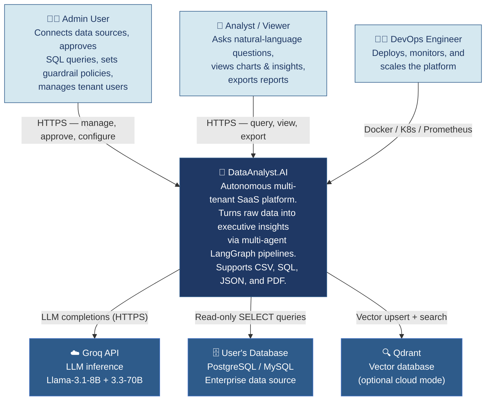
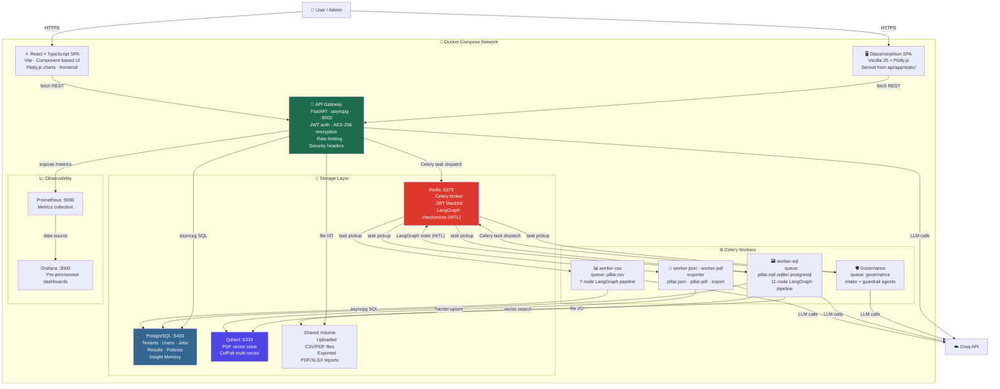
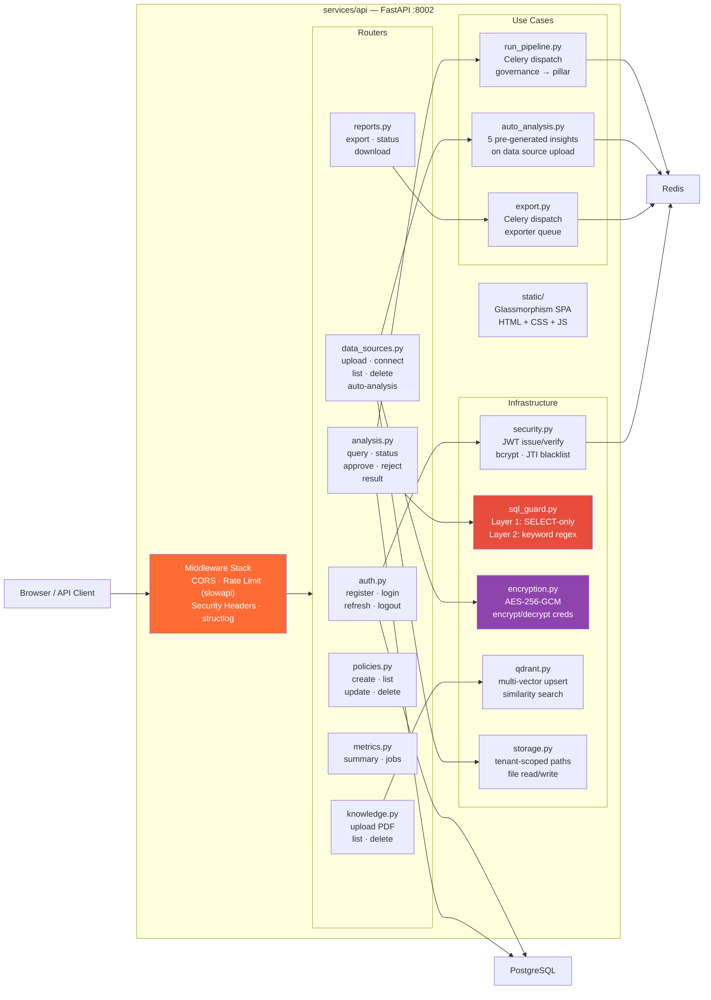
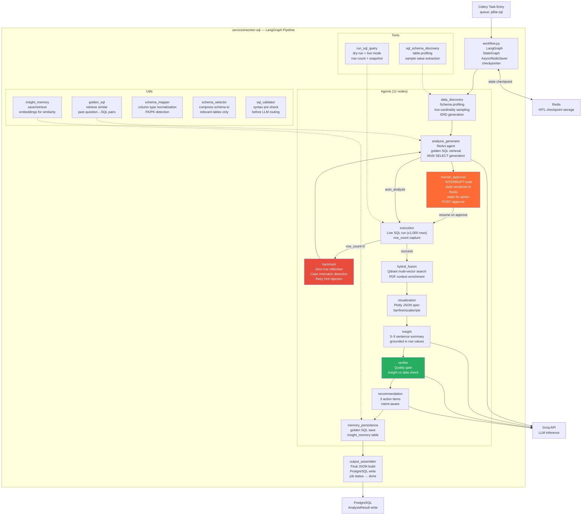
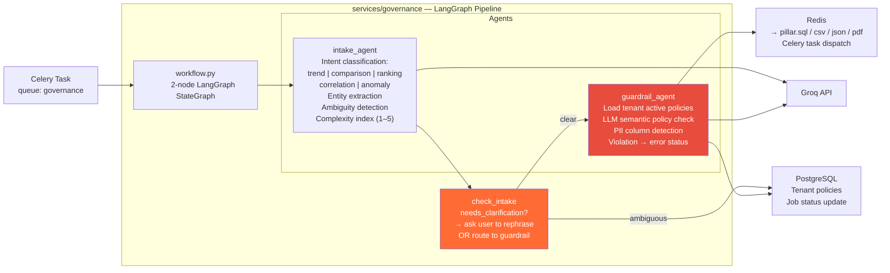
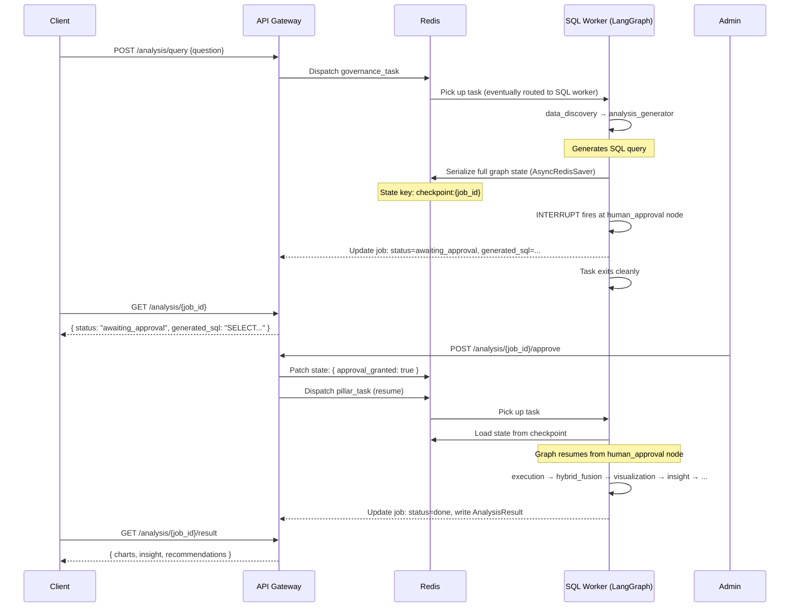

# C4 Architecture Diagrams

**DataAnalyst.AI — Autonomous Enterprise Data Analyst**

> C4 Model: four levels of zoom — Context → Container → Component → Code.  
> Each diagram narrows scope. Start at Level 1 for the big picture.

---

## Level 1 — System Context

*Who uses the system, and what external systems does it interact with?*



---

## Level 2 — Container Diagram

*What are the deployable units, and how do they communicate?*



---

## Level 3 — Component Diagram: API Gateway

*What are the major components inside the API Gateway container?*



---

## Level 3 — Component Diagram: SQL Worker

*What are the major components inside the SQL analysis worker?*



---

## Level 3 — Component Diagram: Governance Worker

*What are the components inside the Governance worker?*



---

## Level 4 — Code Diagram: HITL Sequence

*How does Human-in-the-Loop approval work at the code level?*



---

## Level 4 — Code Diagram: Zero-Row Reflection

*How does the agent heal itself when a SQL query returns no results?*

```mermaid
sequenceDiagram
    participant Gen as analysis_generator
    participant Exec as execution
    participant Router as route_after_execution
    participant Back as backtrack
    participant State as LangGraph State

    Gen->>State: Write generated_sql = "SELECT ... WHERE quarter = 'q4'"
    Gen->>Exec: Route → execution
    Exec->>Exec: Run SQL against live DB
    Exec->>State: Write row_count = 0, reflection_context = null

    Exec->>Router: route_after_execution()
    Router->>State: Read row_count = 0
    Note over Router: row_count = 0 → reflection path
    Router->>State: Extract SQL literals: ["q4"]
    Router->>State: Compare against schema low_cardinality_values: quarter=["Q1","Q2","Q3","Q4"]
    Router->>State: Write reflection_context = "Case mismatch: 'q4' should be 'Q4'"
    Router->>Back: Route → backtrack

    Back->>State: Read reflection_context
    Back->>State: Write hint = "User used lowercase 'q4'; correct value is 'Q4'. Retry with exact case."
    Back->>State: Increment retry_count (now 1 of 3)
    Back->>Gen: Route → analysis_generator (retry)

    Gen->>Gen: Incorporate hint from state
    Gen->>State: Write generated_sql = "SELECT ... WHERE quarter = 'Q4'"
    Gen->>Exec: Route → execution
    Exec->>Exec: Run SQL against live DB
    Exec->>State: Write row_count = 5 ✓
    Exec->>Router: route_after_execution()
    Router->>Router: row_count > 0 → success path
    Router->>Router: Route → hybrid_fusion
```

---

## Architecture Decision Records (ADR)

| Decision | Choice | Rejected Alternatives | Rationale |
|---|---|---|---|
| Inter-service communication | Celery + Redis queues | Direct HTTP, gRPC | Decoupling — API works even when workers are restarting |
| HITL state persistence | Redis (AsyncRedisSaver) | PostgreSQL, in-memory | Survives worker restart; Redis is already in the stack |
| LLM provider | Groq (Llama) | OpenAI GPT-4, Claude | Sub-second inference latency; cost; LangChain abstraction enables easy swap |
| PDF embedding strategy | ColPali multi-vector | Text-only chunking | Preserves visual layout, tables, and charts; no text extraction required |
| Credential encryption | AES-256-GCM in DB | AWS Secrets Manager | Zero external dependencies; clear migration path to secrets manager |
| Tenant isolation | Shared DB + tenant_id | One DB per tenant | Simpler ops at NTI-project scale; equivalent isolation guarantee |
| Frontend | Vanilla JS SPA + React/TS | Angular, Vue | Vanilla for zero-build-step demo; React for production component reuse |
| Observability | Prometheus + Grafana | Datadog, New Relic | Self-hosted; zero cost; provisioned automatically |
