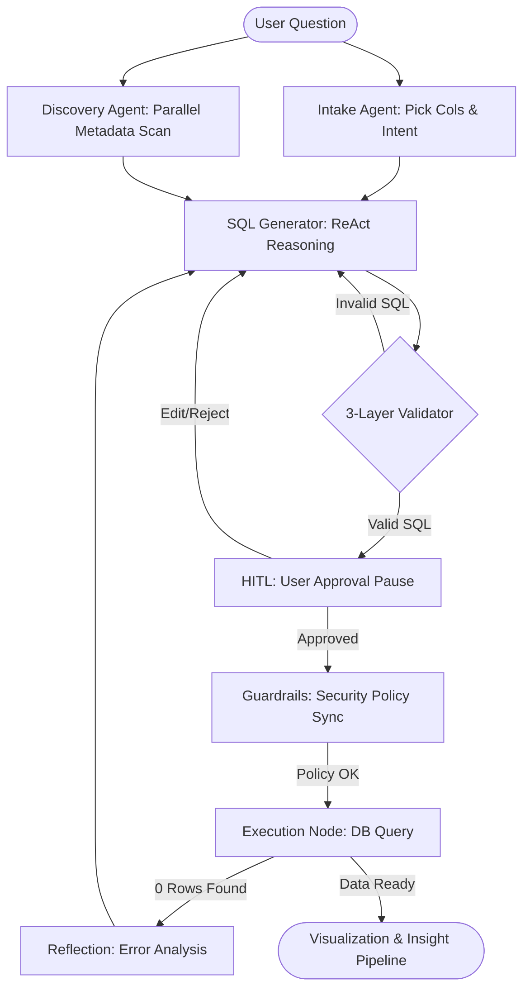

# SQL Engineering: The Definitive Master Guide
**Project**: Executive Analyst AI — SQL Pipeline Team
**Aesthetic**: Enterprise-Grade Documentation (Zero-Loss Detail Mode)

---

## �️ Part 1: Detailed Technical Architecture & Workflow
This section provides the "boring level of detail" regarding the current implementation of the LangGraph-based SQL pipeline.

### 🔄 Step-by-Step Pipeline Logic
When a request enters the system, the following micro-workflow executes:

1.  **Parallel Core Start**:
    - **Intake**: Analyzes user intent (trend, comparison, etc.) and picks relevant columns.
    - **Discovery**: Simultaneously triggers the `sql_schema_discovery` tool.
    - **Node Coordination**: Both nodes must complete before the state moves to the generator.
2.  **Schema Scanning Engine (`sql_schema_discovery.py`)**:
    - **Parallel Processing**: Uses `ThreadPoolExecutor(max_workers=10)` to map across tables.
    - **Deep Inspection**: Fetches Column names, types, Nullability, Primary Keys (PK), and Foreign Keys (FK).
    - **Data Sampling**: Runs sample queries (LIMIT 3) for every column to give the LLM valid values.
    - **Performance**: Hashes the DB connection string to store/retrieve results from `.cache/schemas/`.
3.  **Reflective SQL Generation (`analysis_agent.py`)**:
    - **Tool-Calling ReAct**: The agent performs up to 3 iterative turns. It can call `run_sql_query` (LIMIT 5) mid-generation to "sanity-check" if a table or join path actually exists.
    - **Schema Packing**: Uses the `_format_compact_schema` algorithm to strip verbose JSON into a dense string: `table: col1(type)* [sample1], col2(type)...` (Saves 70% tokens).
    - **Post-Generation Validation**: Automatically runs a local `SQLValidator` call before finishing.
4.  **The Interruption (HITL Phase)**:
    - **Graph State**: The pipeline uses `interrupt_before=["human_approval"]`.
    - **User Feedback**: The graph freezes. The generated SQL sits in `AnalysisState['generated_sql']`. The user can provide `user_feedback` which routes the graph back to the generator.
5.  **Triple-Layer Security Guard (`sql_validator.py`)**:
    - **Layer 1 (Regex)**: Prevents non-SELECT keywords (DML/DDL like DROP, DELETE).
    - **Layer 2 (EXPLAIN)**: Sends query to the actual DB with `EXPLAIN` prefix. If it fails (missing columns/syntax), it catches the engine error.
    - **Layer 3 (Hallucination)**: Regex-extracts all table names and cross-references them against our Discovery list.
6.  **Self-Correction (Zero-Row Reflection)**:
    - **Zero-Row Trigger**: If execution returns count=0, it doesn't crash. It writes a "Hint" (e.g., *"Filter on 'Status'='Active' gave nothing, but samples show 'ACTIVE'"*) and loops back to the Generator for one auto-correction turn.
7.  **Final Value Chain**:
    - **Visual**: `visualization_agent` Spec -> Dark-Glass Plotly.
    - **Insight**: `insight_agent` -> 3-5 paragraphs of quantified business analysis.
    - **Recs**: `recommendation_agent` -> Suggests 2-3 follow-up analysis questions.

---

## 📂 Internal File Matrix & Responsibilities

#### 1. `app/modules/sql/workflow.py`
- **Role**: The Heart. Defines the `StateGraph` and all conditional edges.
- **Logic**: Manages the `reflection_count` and `retry_count` counters to prevent infinite loops.

#### 2. `app/modules/sql/tools/sql_schema_discovery.py`
- **Role**: The Eyes.
- **Complexity**: Normalizes metadata across PostgreSQL, MySQL, and SQLite.
- **Output**: Generates a Mermaid ERD for the LLM to understand join paths.

#### 3. `app/modules/sql/agents/analysis_agent.py`
- **Role**: The Architect.
- **Logic**: Implements the ReAct system prompt and the compact schema packing logic.

#### 4. `app/modules/sql/utils/sql_validator.py`
- **Role**: The Guard.
- **Logic**: Wraps DB `EXPLAIN` errors to make them "Agent-Readable". Catches schema hallucinations by cross-checking extracted table names against discovered metadata.

#### 5. `app/modules/sql/tools/run_sql_query.py`
- **Role**: The Execution Arm.
- **Logic**: Uses SQLAlchemy `text()` with parameters to block SQL injection.
- **Serialization**: Contains custom handlers for `Decimal`, `DateTime`, and `UUID` types to ensure the result-set is JSON-serializable for the Plotly frontend.

#### 6. `app/domain/analysis/entities.py`
- **Role**: The State Definition.
- **Key Fields**:
    - `generated_sql`: The final validated query.
    - `intermediate_steps`: A high-fidelity log of LLM thoughts and tool results.
    - `business_metrics`: A dictionary of formulas (e.g., "Active User = Login in last 30 days") that the generator *must* use to build the query.

### 💾 High-Detail Data Flow (Mermaid)

---

## 🌟 Part 2: Strategic Enhancement Roadmap (All 17 Ideas)

### 🧩 Group A: Performance & Infrastructure
1.  **Schema Metadata Caching**: definitive Redis layer for schema JSON.
2.  **Async Database Execution**: Migrate to `asyncpg`/`aiosqlite` for non-blocking I/O.
3.  **Integrated Connection Pooling**: Single engine instance shared across the entire app.
4.  **Streaming Result Handling**: Chunked loading for massive datasets.
5.  **Parallel Agent Nodes**: Explicit LangGraph parallel nodes for simultaneous discovery.

### 🤖 Group B: Agentic Intelligence (Accuracy)
6.  **Semantic Schema Selection (RAG)**: Retrieval of relevant tables only (for >100 table DBs).
7.  **Automated Query Optimization**: Using `EXPLAIN` cost analysis to suggest faster joining strategies.
8.  **Dynamic Few-Shot (Golden SQL)**: Library of "perfect queries" used as dynamic context.
9.  **Verifier Node (LLM-Judge)**: Post-execution check for business intent fulfillment.
10. **Context-Aware Debugger**: Dialect-specific traceback injection for auto-fixing.
11. **Backtracking Router**: "Rewind" capability for failed multi-table join paths.

### 🧠 Group C: Advanced Features & Strategic Fusion
12. **Content Retrieval (Value Sampling)**: (Priority) Auto-discovery of enum values (e.g., Status codes).
13. **Hybrid Insight Fusion (SQL + PDF)**: Melding structured data with manual context.
14. **Semantic Layer / Metric Mapping**: Pre-defined SQL snippets for "Revenue", "Churn", etc.
15. **RAG Schema Mapper**: Translating cryptic legacy column names into business language.
16. **Historical Insight Memory**: Trend analysis across different sessions using Vector DB.
17. **Heterogeneous SQL/Vector Join**: Joining SQL tables with PDF/KB support tickets in the LLM workspace.

---

## 🗓️ Implementation Sprints
1.  **Sprint 1**: (Accuracy) A12: Content Sampling + A13: Hybrid Fusion.
2.  **Sprint 2**: (Reliability) A9: Verifier Node + A10: Debugger.
3.  **Sprint 3**: (Speed) A1: Global Metadata Cache + A4: Result Streaming.

---
> [!IMPORTANT]
> This document replaces ALL previous documentation. It is the single definitive guide.
